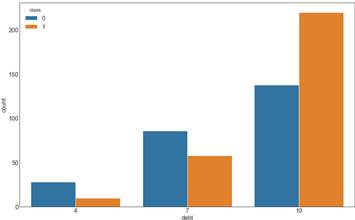
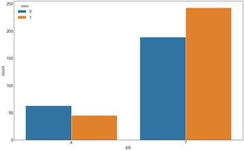
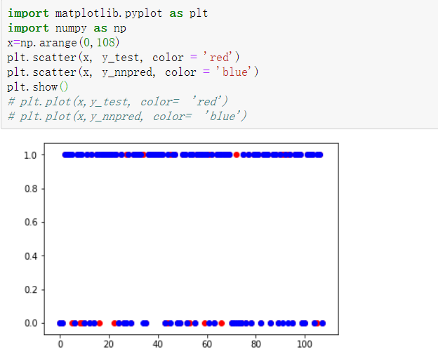

# 银行信用

##  挖掘目标定义

> ​	信用评分的目的是通过构建信用评分模型，评估贷款人或信用卡申请人的风险等级，从而为银行放贷、信用审批等业务提供决策支持。
>
> ​	个人信用评分: 把数学和统计模式用于个人信贷发放决策，对个人履行各种承诺的能力和信誉程度进行全面评价，确定信用等级。
>
> ​	建立符合我国国情的量度信用风险的信用风险评估体系，客观、全面、准确地评估消费者的还款能力和还款意愿，识别信贷申请人的个人信用风险

## 数据准备

---

---

### 数据导入

### 数据预处理

 **判断有无缺失值**

> 没有缺失值，不需要进行缺失值处理

**探索各个变量之间的关系**

> 各个变量之间相关性小，不需要剔除变量

**独热编码**

​	

> 特征缩放 ：经测试，特征缩放后会影响模型的准确度，我们不予考虑

## 数据探索

> 可视化分析

## 模型建立

### Logistic 回归

**Logistic模型训练**

**在测试集上预测及预测结果可视化**

**预测结果评估（ROC曲线及混淆系数）**

### 神经网络

**模型训练**

**在测试集上预测及结果可视化**

**预测结果评估**

### 随机森林

**模型训练**

**测试集上预测与可视化**

### 层次分析

**系数矩阵**

**RI（一致性评价指标）**

**归一化**

**权重**

**特征值与CI,CR**

**一致性检验**

> CR小于0.1 ==》 一致性检验通过

##  模型评估

| 模型          | 预测评估     |
| ------------- | ------------ |
| Logistic 回归 | R^2 ≈ 0.8333 |
| 神经网络      | R^2 ≈ 0.8426 |
| 随机森林      | R^2 ≈0.8210  |

## 模型的部署

